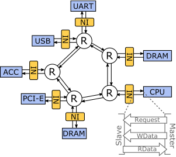

# NoCpad #

### AMBA AXI-4 Network on Chip designed for HLS ###

NoCpad provides optimized HLS-ready SystemC models of all required Network-on-Chip components, such as network interfaces and routers (including virtual channels), in order to build a scalable AMBA-compliant SoC interconnect fabric. Quality of results in terms of networking performance as well as hardware PPA matches closely that of custom RTL.

Network interfaces translate AMBA AXI-4 transactions to an internal versatible packetized protocol that is routed through a Network-on-Chip (NoC). Both *coherent* and *non-coherent* transactions are supported including AXI4, ACE network interfaces. Furthermore, ACE-Lite interfaces enable agents with no caches (such as DMA controllers or hardware accelerators) to access shareable data and participate in a mixed ACE and ACE-Lite interconnect.

Link-level communication between components is performed using Connection channels, included in Mentor's Catapult HLS [HLSLibs](https://github.com/hlslibs/matchlib_connections), and MatchLib, a SystemC/C++ library of commonly-used hardware functions and components [MatchLib](https://github.com/NVlabs/matchlib)

Why does it make sense to build a NoC using HLS?
- NoC can change many times during design flow 
    - Changes can be structural and/or architectural
    - Re-verification should be fast
- SystemC/C++ models abstract enough to be highly configurable
    - Complex customizations can be easily architected
    - C++ simulation is faster
- HLS constraints can produce the needed result
    - Or even lead to new unexplored alternatives 
    - No need for re-verification

NoCpad targets agile interconnect development. The designer of the network fabric can choose across non-coherent AXI-4 interfaces or coherent ACE interfaces to
compose an efficent NoC. Data transfer is handled by NoC routers that support simple wormhole or virtual-channel flow control. In all cases, contention is resolved by arbiter modules chosen from a library of various arbiter architectures.

AMBA-AXI4 interfaces :
- AXI porotocol compatibility 
    - All burst types
    - Multiple configurable transaction IDs
    - Arbitrary data lane widths, even under the same interconnect
    - Narrow and unaligned transactions
- Internal packet based transport protocol 
    - Arbitrary internal NoC widths
- Matchlib AXI class definitions for easy interoperability

AMBA-ACE, ACE-Lite interfaces :
- ACE porotocol compatibility
    - Various cache line sizes
    - Interconnect's Data channels, are currenty sized depending the chosen cache line width
    - HOME-Node for transaction PoS (Point-of-Serialization) and protocol management
    - Multiple HOME nodes support for load balancing
    - ACE-Lite support for uncached agents
    - Support for the optional snoop data response 
    - Mixed coherent and non-coherent traffic
- Internal packet based transport protocol 
- Extends Matchlib definitions for ACE support, based on the AXI paradigm 

NoC Routers :
- Configurable number of Input/Output ports
- Various arbitration schemes
- Able to form arbitrary network topologies
- Two forms of link-level flow control
    * Wormhole routers with Ready-Valid flow controll using Connections
    * Virtual Channel based usin Connections and credit-based flow control

Library of arbiter components:
- Fixed Priority
- Round Robin
- Matrix arbiter 
- Weighted Round Robin
- Deficit Round Robin
- Merged arbiter multiplexers

## Getting Started ##

### Tool versions ###

The codebase is based on Connections and MatchLib, and follows the similar tool/dependency versions:

* `gcc` - 4.9.3 (with C++11)
* `systemc` - 2.3.1
* `boost` - 1.68.0
* `catapult` - 10.5a
*  connections - included with catapult
* `QuestaSim` - 2019.3_1

### Environment requirements

Makefiles and synthesis scripts expect the following environment variables:
(A sample bash script can be found in examples/setenv.sh)

* `CATAPULT_HOME`
* `SYSTEMC_HOME`
* `BOOST_HOME`
* `MATCHLIB_HOME`

In addition, the boost and systemc library locations are expected to be in `LD_LIBRARY_PATH`.

### C++ compile and simulate
    cd examples/<example>
    make
    ./sim_sc 

### Mentor Catapult synthesis
    cd examples/<example>
    catapult -file go_hls_ic.tcl

## Contributors
Dimitris Konstantinou, Giorgos  Dimitrakopoulos, Dionisis Filippas

## Pending additions
- AMBA AHB5 network interfaces

## License
NoCpad is licensed under the [MIT License](./LICENSE).

